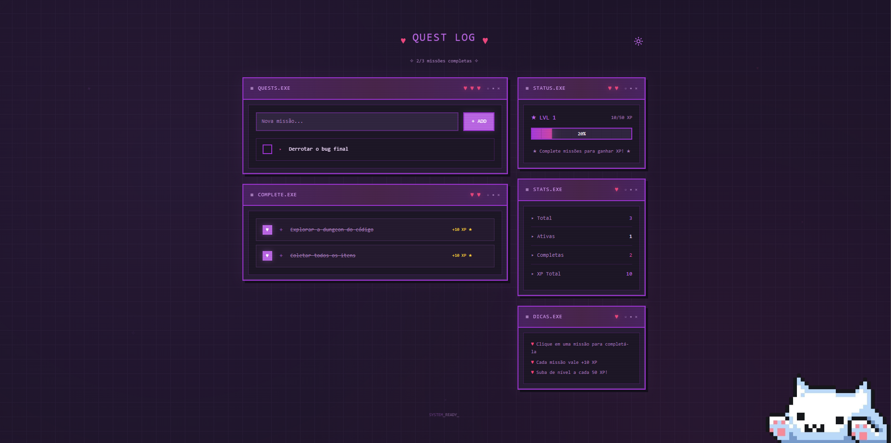
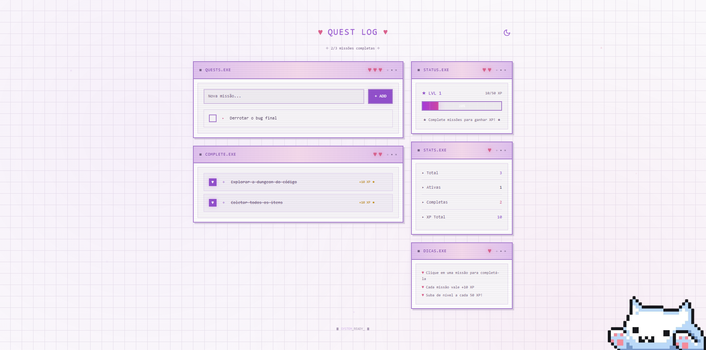

<h1 align="center" > ◅◌ Quest task ◌▻ </h1>

<p align="center"> <strong> Aplicação de tarefas com gamificação leve e foco em UI.</strong> </p> <p align="center"> Transforme tarefas do dia a dia em missões visuais. </p>

### ◌ Sobre o projeto

O Quest task é uma aplicação de lista de tarefas desenvolvida com foco em experiência do usuário, feedback visual e interface limpa.
A proposta é tornar a organização mais intuitiva e agradável, utilizando conceitos de gamificação de forma sutil.

### ◌ Executar o projeto

```
git clone https://github.com/Duududs/Quest_task.git
cd quest_task
npm install
npm run dev
```

### ◌ Princípios de UI

- Simplicidade acima de tudo
- Feedback visual claro
- Interface sem ruído
- Interações rápidas

### ◌ Preview

- Dark_mode
<p align="center">  </p>

- White_mode
<p align="center">  </p>

<p align="center"> ══════ •『 ♡ 』• ══════ </p>
